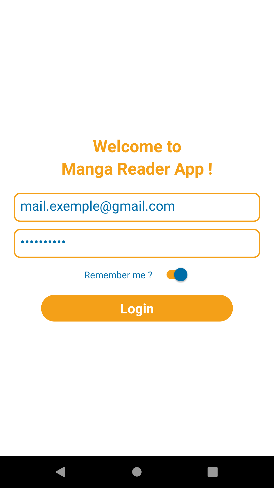
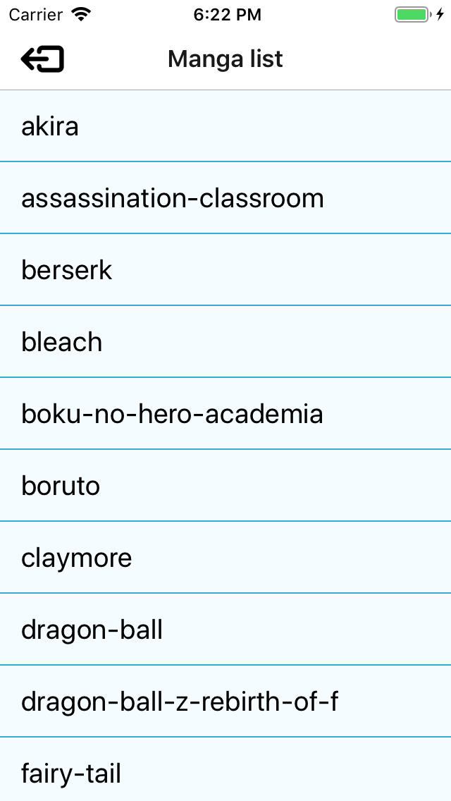
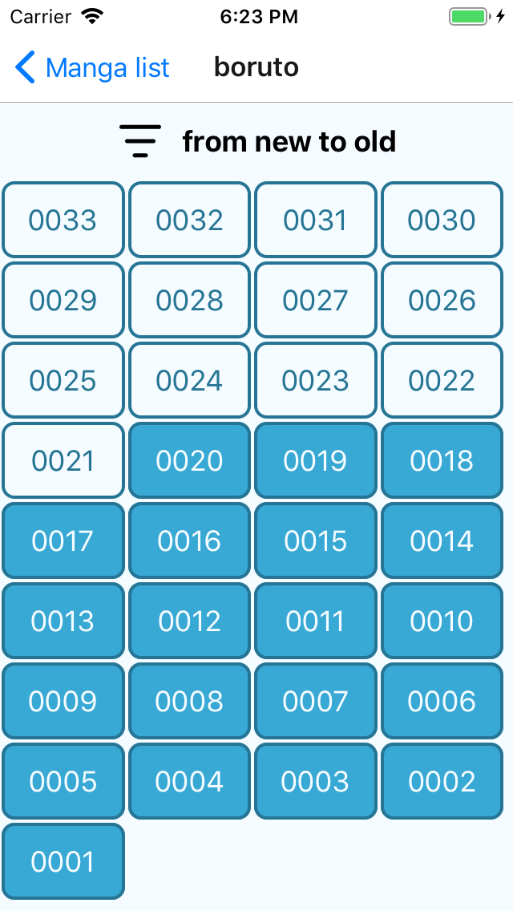
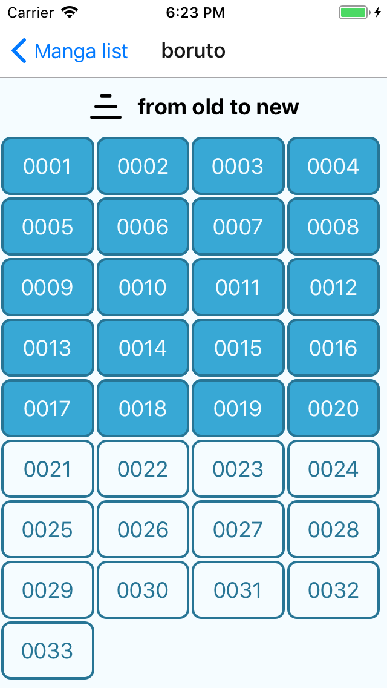
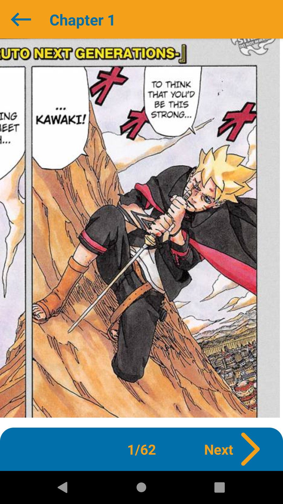

# MangaReaderApp-React-Native
Personal project : app to read manga scans from a database created on Cloud Firestore (Firebase)

## Login screen
Login with mail and password and remember me option.

## Manga list screen

## Chapter list screen
Possibility to filter from new to old and from old to new.
Long press on chapter saved them as read or unread.

## Reading screen
Possibility to zoom on page images (see [@dudigital/react-native-zoomable-view](https://github.com/DuDigital/react-native-zoomable-view))

