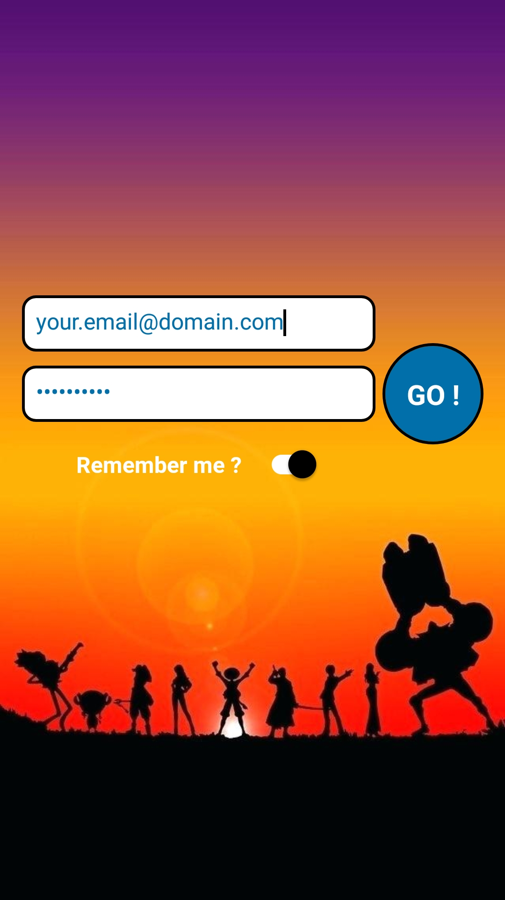
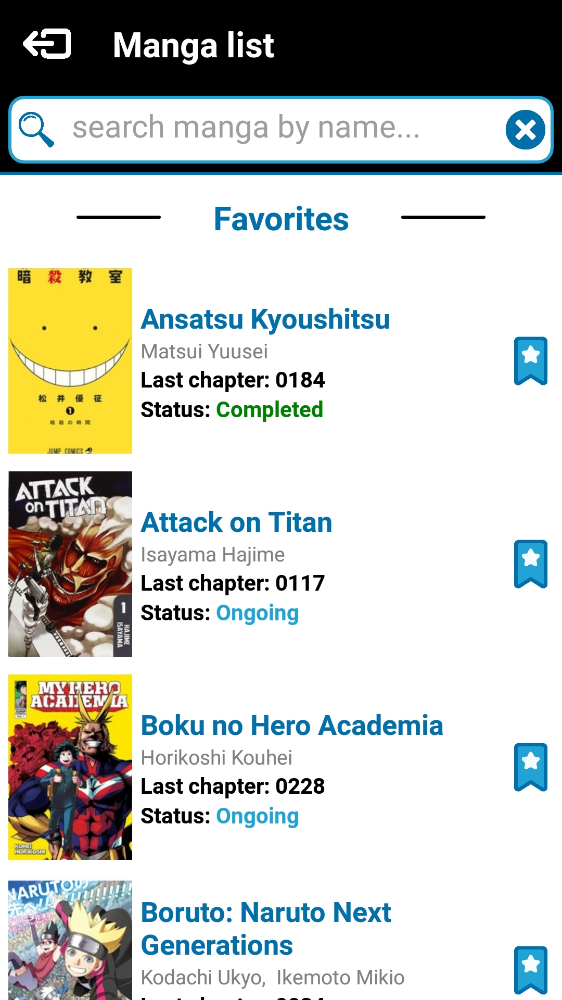
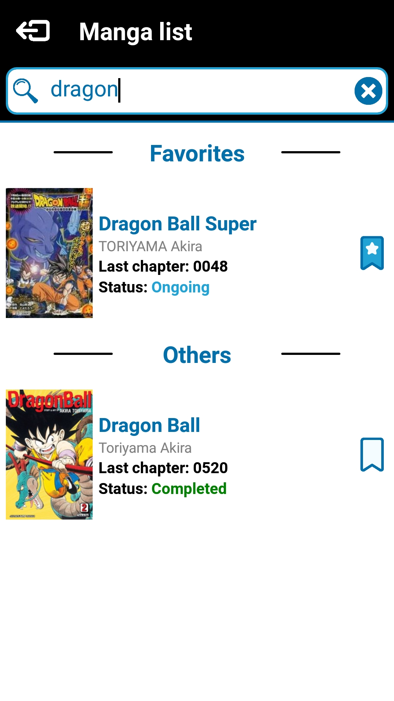
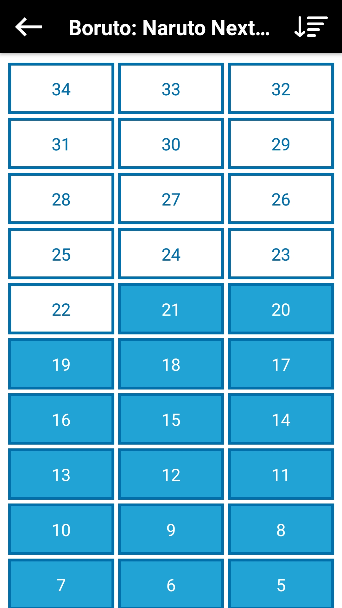
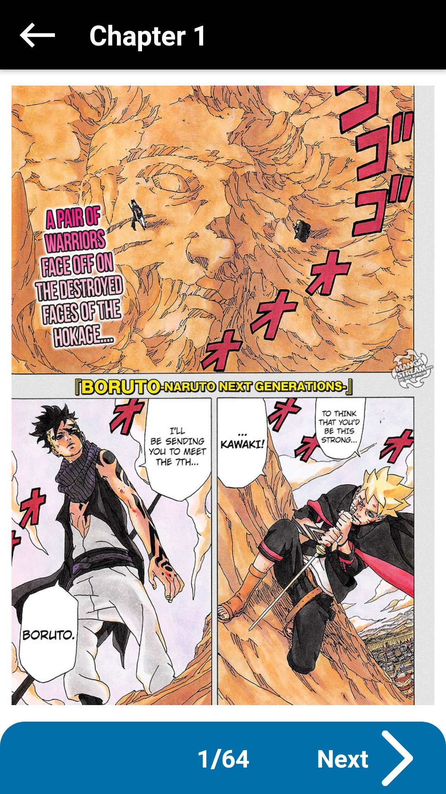
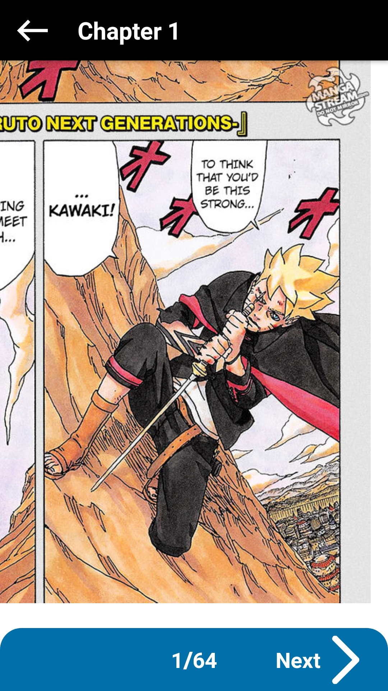

# MangaReaderApp-React-Native
Personal project : manga reading app working on Android and iOS.  
Both app are connected to a [Firebase](https://firebase.google.com) project witch allow
 them to access a NoSQL database ([Cloud Firestore](https://firebase.google.com/products/firestore/)).  
Database is in this format : mangas > manga > chapters > chapter > pages > page.url

## Login screen
> Login with mail and password and remember me option.

## Manga list screen
> Possibility to mark manga as **favorite**

## Manga list screen search 
> Possibility to search manga by name

## Chapter list screen
> Possibility to filter from new to old and from old to new.
> Long press on chapter saved them as read or unread.

## Reading screen
> Possibility to zoom on page images (see 
[@dudigital/react-native-zoomable-view](https://github.com/DuDigital/react-native-zoomable-view))

